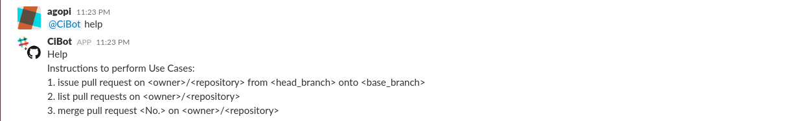
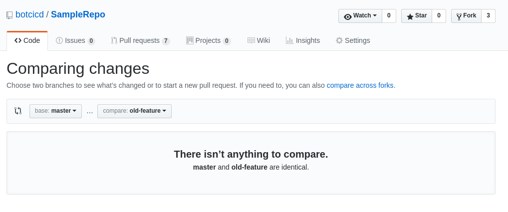
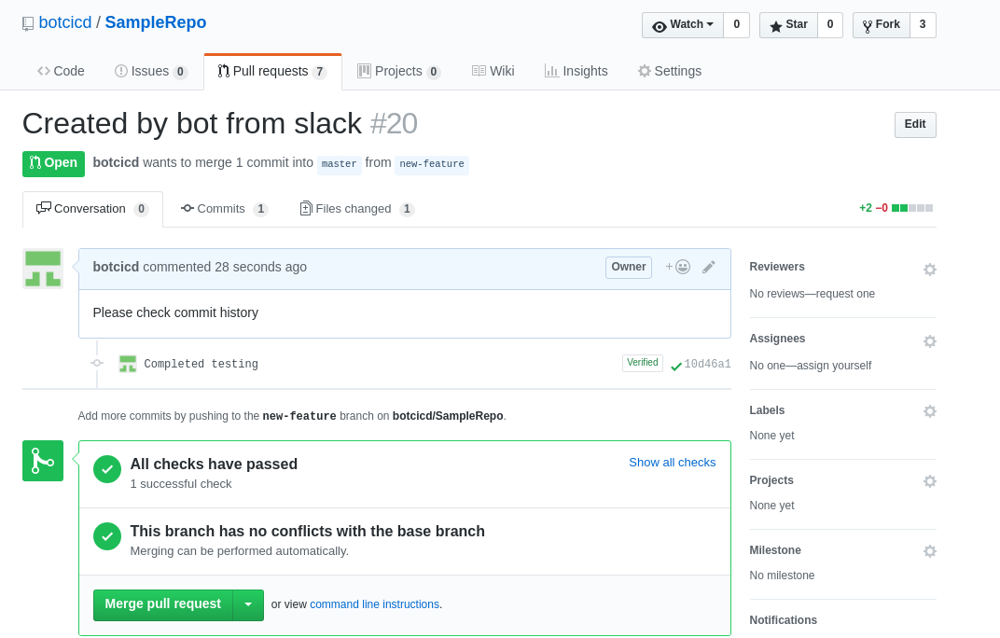
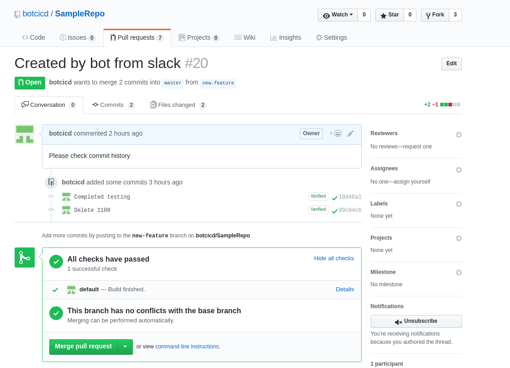

## Acceptance Test

### Login Credentials 

#### Slack 

Team: https://se-project2017-at.slack.com/

login: sebotcicd@gmail.com

password: tauser1-slack

#### Github

username: botcicd

password: seprojfall17

#### Jenkins

URL: ec2-54-147-235-179.compute-1.amazonaws.com:8080

username: root

password: guest

### Cibot

Inorder to talk to the Cibot, please login to the slack workspace with credentials provided above. We can get the list of 
commands that can be used with Cibot by first pinging it with help as follows:

### Use Case 1 ( Issuing pull request)

For issuing pull request, we can make changes on an existing branch and issue a pull request from that branch `head` to another
branch `base`. Within 5 minutes, it'll trigger a build on the pull request at [jenkins](http://ec2-54-147-235-179.compute-1.amazonaws.com:8080/job/SampleRepo_pullrequest/).
If the build succeeds ( The tests run will always succeed unless manually stopped), it'll update the checks on github as passed.

Note: Please use above github credentials and jenkins login credentials 

#### Testing: 

##### Introduction 
After logging into github, please head to the [SampleRepo](https://github.com/botcicd/SampleRepo). Create a new change using the UI
(This will be easier to perform rather than having to clone the repo, update credentials, make changes to a branch/ create a new branch and make changes.
For ease of testing, we already have made changes on branch `new-feature`. We can check the changes by heading to [changes](https://github.com/botcicd/SampleRepo/compare/master...new-feature)

As we can see it has an additional change when compared to master branch. 

We have also created another branch `old-feature` which doesn't have any changes made on it. 

As we see there are no changes when compared to master branch. 

##### Issuing a pull-request on slack

We can issue a pull-request for the [SampleRepo](https://github.com/botcicd/SampleRepo) from branch `new-feature` onto branch `master`
by simply typing `issue pull request on botcicd/SampleRepo from new-feature onto branch` and if successful bot will reply as follows.

If it's not successful because of giving invalid branch names or no changes present it will reply as follows:

After issuing a succesful pull request we can check that it's been created at [pullrequests](https://github.com/botcicd/SampleRepo/pulls). 
We can then click on the newest pull request issued and it will be as follows. There'll be no mention of checks

The jenkins server has a [job](http://ec2-54-147-235-179.compute-1.amazonaws.com:8080/job/SampleRepo_pullrequest/) that monitors the repo for any pull request submitted which runs every 5 minutes.
Please wait for 5 minutes before a new job will be triggered

Once the jenkins build has succeeded, we can now head to [pullrequests](https://github.com/botcicd/SampleRepo/pulls) and click on the pull request.
we'll now see that the checks has passed will show up as follows.

### Use Case 2 ( List open pull requests)

We can get a list of all open pull-requests for the [SampleRepo](https://github.com/botcicd/SampleRepo) by simply typing in slack `list pull requests on botcicd/SampleRepo`. The bot will then reply witha  drop down list allowing user to select the PR number as follows:

Clicking on any of the numbers will show more details about the particular pull request and also give the user a choice to merge the pull request. Following is the output when chosen the number 11.

We can head over to [pullrequests](https://github.com/botcicd/SampleRepo/pulls) and see if it's showing the same pull requests and click on the same number and verify the details. 

We can merge that particular request by clicking on merge directly but we'll be testing the particular feature independently in the next use case. 

### Use Case 3 ( Merge pull request) 

We can also issue a merge request directly by providing the bot with a merge command, the repo name and pull request number.
for example `merge pull request 20 on botcicd/SampleRepo` as follows. 

The logic first checks if the user requesting merge option is an admin, we've an inbuilt list of admins (we've added your user to admin list) and then checks if the jenkins build has succeeded for the particular request. Say we're doing it for number 20 we can head to [pullrequests](https://github.com/botcicd/SampleRepo/pulls) and click on number 20 to verify if checks have been passed. It'll look as follows:

As we can see that because it says the checks have been passed, we can click on details under checks to look at jenkins job build that was triggered for the particular pull request. It'll look as follows:

As you can see it mentions the pull request number and also that there are no merge conflicts. 

All of this checks are done by the bot once we press merge. After pressing merge we can head back to the pull request page at [pullrequests](https://github.com/botcicd/SampleRepo/pulls) *note please add the pull request number after url* and we'll now see that it has been merged, it'll look as follows:

