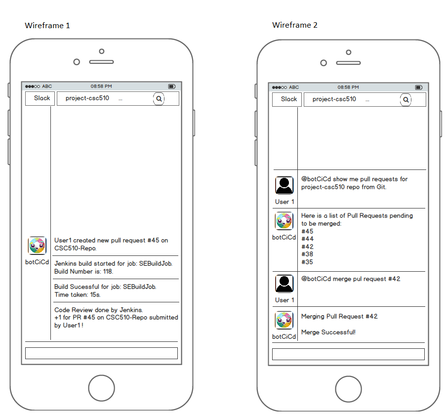

# CSC510 Project Design

* ## Problem Statement

Developers tend to work on multiple projects at once and collaborate with other contributors where it's important to
establish a line of communication so that everyone in the team is updated of changes that happen. There are multiple
services like Git, Jenkins(automation server) and sometimes deployment to PaaS service like Heroku. Building a pipeline
requires a lot of co-ordination between all the services, but at the same time there's no one common line of communication
that exists to keep users updated of what is happening and provide a one-stop platform to monitor pipeline, trigger certain
aspects of pipeline and provide for interaction with peers facilitating voting on code review. 

Our project botCiCd aims to help in reducing all the manual work that most software developments teams have to go through for getting the code from their machines deployed to the server, while ensuring that all communication takes place on slack 
channel and providing the user to perfom actions by simply asking Bot to perform task.

* ## Bot Description

botCiCd essentially provides a simple command based interface for performing simple tasks like:

  * Get notifications on Slack whenever someone pushes code in Git.
  * View and merge Pending Pull requests from Git repository on Slack.
  * Trigger auto-builds and execute test cases/code quality tools in Jenkins.
  * Report the build status on Slack after the Jenkins build is complete.
  * View status of old builds from Jenkins.
  * Allow for team members to vote on changes through slack messages. 
  * Trigger auto deployments to server if the build is successful and passes all the tests.
  * Manually do a deployment to the server if needed.
  * Receive notifications on Slack regarding the status of the deployment - Successful/Failed.

Having these features in our bot helps solve the problem of coordination within the team as all the notifications are received on Slack and thus the entire team is aware of the changes going on. Also, it helps the developers avoid the manual process of going to multiple parties to get the job done.

All the commands for the bot are to be designed in such a way that the users can just tell the bot what to do in simple English sentences and the bot will automatically parse the sentence and trigger the required commands in the back end. This way, the users do not have to remember difficult and specific commands to get the job done.

Among the categories discussed in class, this bot fits into the *DevOps* bot category, because it is helping the developers access various tools from within a conversation with the bot and allows the users to manage deployments and receive notifications.

* ## Use Cases
### Use Case 1: View and merge Pending Pull requests from Git repository on Slack
1. Preconditions:
   * User must know the name of the Git Repository. 
2. Main Flow:
   * User will request the pull requests and provide name of the repository [S1]. Bot will provide a list of the Pull requests pending for merge with their status (i.e. checks passing or failing), code-reviews by other users and ask the user for the PR number to be merged [S2]. User replies the PR number of the PR to be merged [S3]. Bot merges the pull request specified, if all checks have passed and posts the status on Slack [S4].
3. Subflows:
    * [S1] User will type sentence like `@slackbot show pull requests for <Repo Name>`.
    * [S2] Bot will return list of pending pull requests for the given repo and ask for the if user wants to merge.
    * [S3] User will reply with Pull Request number which needs to be merged.
    * [S4] Bot will merge the pull request if it can be merged and post a message to slack.
4. Alternative Flows:
    * [E1] Repo is unavailable: Bot will reply `Repo Unavailable`.
    * [E2] Pull Request number requested is unavailable or it cannot be merged: Bot will reply `PR Unavailable` or a reason why the PR cannot be merged.
    * [E3] In case of a merge conflict, the PR will not be merged and the necessary parties will be notified on Slack. 

### Use Case 2: View status of a particular build number of a Job in Jenkins and rebuild
1. Preconditions
   * User know the name of the Jenkins Job 
   * User should know the build number or flow [E2]
2. Main Flow
   * User will request the status of the build number by providing with name for the Jenkins Job [S1]. Bot will provide the status and also ask user if he wants to Rebuild [S2]. User replies Yes to rebuild that particular build [S3]. 
3. Subflows
   * [S1] User will type sentence like `@slackbot show builds for <Job Name> <Build Number>`.
   * [S2] Bot will return status (Pass/Fail) and asks if the user wants to rebuild the job (Yes/No).
   * [S3] User will reply Yes or No.
4. Alternative Flows
   * [E1] Jenkins Job unavailable or the user does not have proper permission: Bot will reply `Job Unavailable`
   * [E2] User doesn't give a specific Build Number: Bot replies with last 5 builds and their statuses. 

### Use Case 3: Turn on automatic notifications for a Jenkins Job
1. Preconditions
   * User must know the Job name.
   * Bot must have authentication to access the jenkins server
2. Main Flow
   * User will request automatic notifications for a Jenkins Job and give the job name [S1]. Bot will confirm that notifications are turned on for the Jenkins Job [S2]. Once the Jenkins build is complete, bot will reply with the details of the build [S3].
3. Subflows
   * [S1] User will type sentence like `@slackbot enable build notifications for <job name>`.
   * [S2] Bot will return confirmation that notifications are turned on for the requested Jenkins Job.
   * [S3] Bot replies with the build status and other details like time taken for build, changes processed etc. 
4. Alternative Flows
   * [E1] Jenkins Job unavailable or the user does not have proper permission: Bot will reply `Job Unavailable` or `No Permission`.
   
### Use Case 4: Provide voting on a pull request
1. Preconditions
   * User must know the repo name and PR number.
2. Main Flow
   * User will vote for a pull request and it +1 or -1 [S1]. Bot will then store the data and update the final review [S2]. 
3. Subflows
   * [S1] User will type sentence like `@slackbot vote <repo> <pr> +1/-1`.
   * [S2] Bot will update redis database to store vote for the PR and display the current total vote.
4. Alternative Flows
   * [E1] PR unavailable or already merged will make bot to reply`PR invalid` or `Already merged`.
   

* ## Design Sketches
### Wireframes

### Storyboard

* ## Architecture Design + Additional Patterns

Higher level Architecture design

### Architecture Components:

The Platform we would be using to do our Project would be Slack.

Components include:

1. botCiCd - Its main objective would be interfacing with Slack, monitor the git repository, interfacing with Jenkins and the Datastore. It acts as the logic and will relay information and co-ordinate tasks between other services like Slack

2. Slack interface - This would be the interface that would connect the BOT with the slack platform. Its main usage would be to act as a platform for botCiCd to post updates and facilitate interaction with user. The user can give commands to merge a pull request, request details of a jenkins job build, vote on a particular pull request etc. The botCiCd posts updates about 
changes made to a repo, Jenkins job status, etc..

3. Git server : This is where the repository is situated remotely. The repositories are configured with necessary webhooks to integrate with jenkins and trigger a build when a new pull request is submitted. Jenkins will also have a job and have the tokens to merge branches for the given git repository. 

4. Jenkins: When a pull request is issued, it'll trigger the jenkins to build the job. It'll notify the botCiCd that a build has been triggered and it'll also report the status to botCiCd. When requested by botCiCd, it'll build a job or a particular build, and also return the details requested about a particular job. Some of the jobs that the botCiCd will trigger are merging the repositories, running test suite etc..

5. Datastore: The datastore will hold the data related to voting and other details that help relating a build number to the user who issued the pull request. botCiCd interacts with datastore whenever a user votes on a particular pull request, and it sends data that is stored in datastore. botCiCd can also access the data stored. Currently, we're looking at using a datastore like Redis but can also use conventional database like cockroachDB. 

3rd Party in our project include Git, Jenkins and Heroku.

The type of architecture we are looking at is a hybrid of Event Driven and DataFlow i.e. it will be event driven between the GIT and the Bot and once the BOT gets the event, after it would be DataFlow architecture.

Data Store

Constraints in design:

1. The slack bot should not send anything to Git. It should only be listening on the Git interface.   

2. The only interaction that the user will have with slack is when he/she gets the status updates. The user shall not send anything to the Bot.

