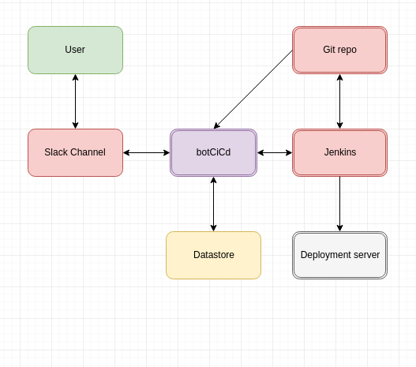
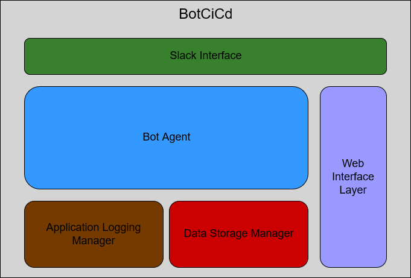

# CSC510 Project Design

* ## Problem Statement

Teams often work on multiple projects, which may involve multiple services, such as Github, Jenkins or production environments. Each project and service provides a separate interface for monitoring events and managing actions, meaning often there is no one-stop platform where everything can be tracked by everyone. Facilitating CI/CD on a project requires integrating updates and providing update on the status of update in pipeline. An update may be requested by initiating a pull request. Integrating the update requires testing changes that may involve running tests on a server like Jenkins. This project aims to reduce the scattered workflow by providing a single platform for pull request management. 

* ## Bot Description

botCiCd essentially provides a simple command based interface for performing simple tasks like:

  * Get notifications on Slack whenever a team member submits a pull request.
  * Provide update of the status/position of the change in pipeline. 
  * Provide outcome of jenkins job for testing the changes. 
  * View pull requests from Git repository on Slack.
  * Merge a particular request.  

Having these features in our bot helps solve the problem of coordination within the team as all the notifications are received on Slack and thus the entire team is aware of the changes going on. Also, it helps the developers avoid the manual process of going to multiple parties to get the job done. 

All the commands for the bot are to be designed in such a way that the users can just tell the bot what to do in simple English sentences and the bot will automatically parse the sentence and trigger the required commands in the back end. This way, the users do not have to remember difficult and specific commands to get the job done.

Among the categories discussed in class, this bot fits into the *DevOps* bot category, because it is helping the developers access various tools from within a conversation with the bot and allows the users to manage deployments and receive notifications.

* ## Use Cases
Common Pre conditions for all the use cases are:
  * Slack bot must be configured with the API token for Git and Jenkins.
  
### Use Case 1: Post updates on pull requests submitted on Slack
1. Preconditions:
   * Jenkins must be configured to alert bot of changes
   * Bot must be configured to look at pull requests on the particular repository
2. Main Flow:
   * Submitting a pull request will trigger the testing job on Jenkins [S1]. Jenkins will then alert the bot [S2]. The bot then accesses the details of the pull request through Git API [S3]. It then posts the details of the pull request on slack [S4].
3. Subflows:
    * [S1] A team member will submit the pull request.
    * [S2] The pull request triggers the job on Jenkins which has a pre-build step alerting the bot by using Rest API.
    * [S3] Bot uses Git API to get details of the particular pull request.
    * [S4] Bot posts initial details of the pull request on slack.
4. Alternative Flows:
    * [E1] Jenkins alerts bot with a post-build step sending information about outcome of job.
    
### Use Case 2: View details of open pull requests on a particular repository

1. Preconditions
   * Bot needs to be subscribed to the repository requested by user
2. Main Flow
   * User will request open pull requests by giving the bot  [S1]. Bot will provide list of open pull requests associated with the particular repository [S2].
3. Subflows
   * [S1] User will type sentence like `@botCiCd pending pull requests for aakarshg/serverprovision`.
   * [S2] Bot will return with list of pull requests along with job status (Pass/Fail)
4. Alternative Flows
   * [E1] User can ask for details of the a particular Pull request by specifying it's number along with repository. 
   * [E2] User can issue merging 
    
### Use Case 3: Merge pull request on a particular repository

1. Preconditions
   * Bot needs to be subscribed to the repository requested by user
   * User needs to be an admin. 
   * The pull request needs to have it's associated Jenkins build status as SUCCESS. 
2. Main Flow
   * User will ask the slackbot to merge a particular request [S1]. Bot will verify the credentials [S2]. Bot will then merge the request through Git's REST API and post update on slack.
3. Subflows
   * [S1] User will type sentence like `@botCiCd merge #1 pull request for aakarshg/serverprovision`.
   * [S2] Bot will verify admin status of user and status of jenkins build.

   

* ## Design Sketches
### Wireframes

### Storyboard
##### Storyboard 1 - Pull Request  
  
   * Pull request will be generated by a team member.
   * This will trigger 2 things - i) botCiCd will notify it on Slack Channel. ii) Jenkins will be initiate the build job.
   * After Jenkins build is completed, status will be notified by botCiCd on Slack Channel. 

##### Storyboard 2 - Merge Request  
  
   * Slack member comments to merge a pull request (using pull request no.) over the Slack Channel. 
   * botCiCd catches the comment, and triggers a jenkins job to merge the pull request over the master branch.
   * Once job gets completed, the status is thrown to slackbot (botCiCd), to push notifications on Slack Channel.

* ## Architecture Design + Additional Patterns
### High Level Architecture Design
The following diagram describes the high level architecture design of our project:

Our Slack bot interacts with following third party services:
  * Git
  * Jenkins
  * Deployment Server

The Platform we would be using to do our Project would be Slack.

Our Slack bot also interacts with a data storage service as descibed in the component architecture below.

### Architecture Components:
The following diagram describes the component level design of our Project:

#### Components include:

1. botCiCd - Its main objective would be interfacing with Slack, monitor the git repository, interfacing with Jenkins and the Datastore. It acts as the logic and will relay information and co-ordinate tasks between other services like Slack

2. Slack interface - This would be the interface that would connect the BOT with the slack platform. Its main usage would be to act as a platform for botCiCd to post updates and facilitate interaction with user. The user can give commands to merge a pull request, request details of a jenkins job build, vote on a particular pull request etc. The botCiCd posts updates about 
changes made to a repo, Jenkins job status, etc..

3. Git server : This is where the repository is situated remotely. The repositories are configured with necessary webhooks to integrate with jenkins and trigger a build when a new pull request is submitted. Jenkins will also have a job and have the tokens to merge branches for the given git repository. 

4. Jenkins: When a pull request is issued, it'll trigger the jenkins to build the job. It'll notify the botCiCd that a build has been triggered and it'll also report the status to botCiCd. When requested by botCiCd, it'll build a job or a particular build, and also return the details requested about a particular job. Some of the jobs that the botCiCd will trigger are merging the repositories, running test suite etc..

5. Logging: This component manages all the logs for the slack bot which the slack bot will create. These logs can be used for debugging purposes later if some issue occurs.

The application follows Data Flow architecture, as the data is flowing from various components - Jenkins, and Git to the User, via our Slack bot. The source of the information is Jenkins and the Sink is the slack user to which the data is ultimately flowing.
It also follows the Event driven architecture, as the botCiCd is continuously monitoring for changes in the slack channel and the repository, triggering jobs accordingly. The botCiCd reacts to changes to either repository or the messages posted in channel. 

#### Constraints:

1. The slack bot needs to be configured with the repositories to watch and thus adding a new repository would have to be done by admin programmatically. 
2. Jenkins can't have more than one build for a particular pull request.
3. The bot can't perform more than one task at a time.
4. The users need to message the bot following particular format. ( Future design may include using wit.ai to perform NLP to allow users to interact with bot)
5. Heavy reliance on slackbot as it'll be the only common platform to provide updates, and also it gives every user on the channel permission to start any job on jenkins or rebuild and also merge pull requests irrespective of whether it passed tests.

#### Additional Design Patterns
1. Observer pattern (behavioral): Our application follows the observer pattern as the slack bot is observing the changes in Git repository and notifying the users of the changes in the slack changes.
