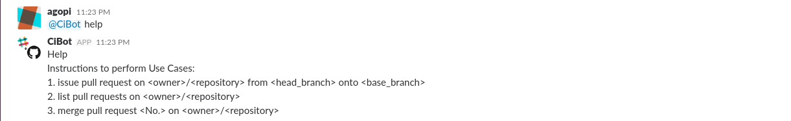
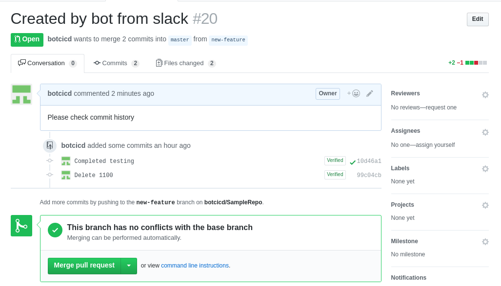
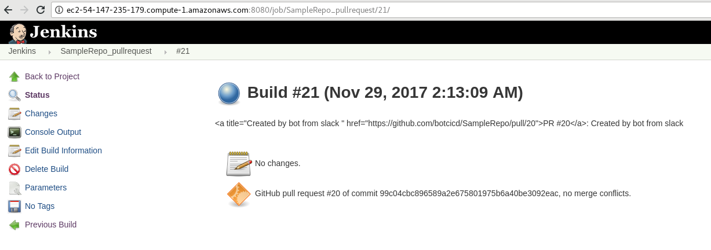
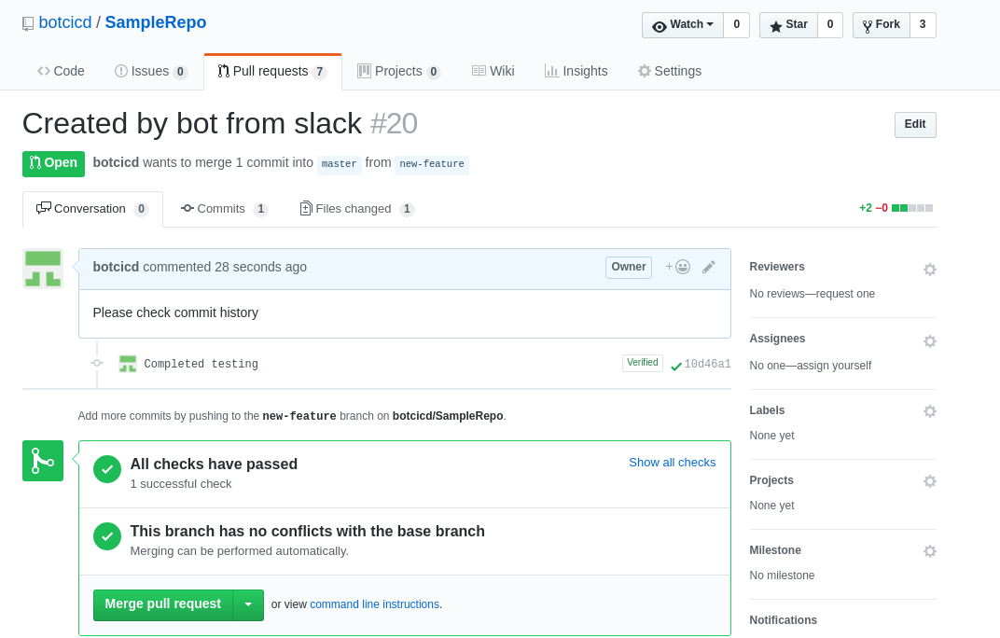
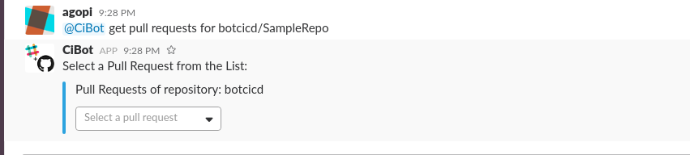
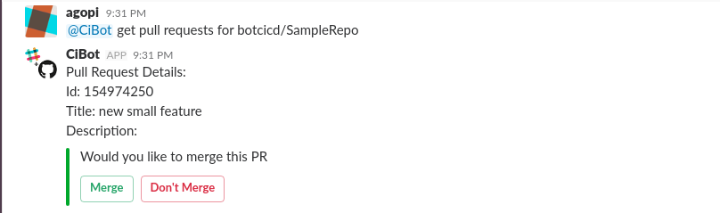
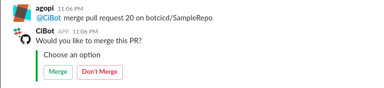
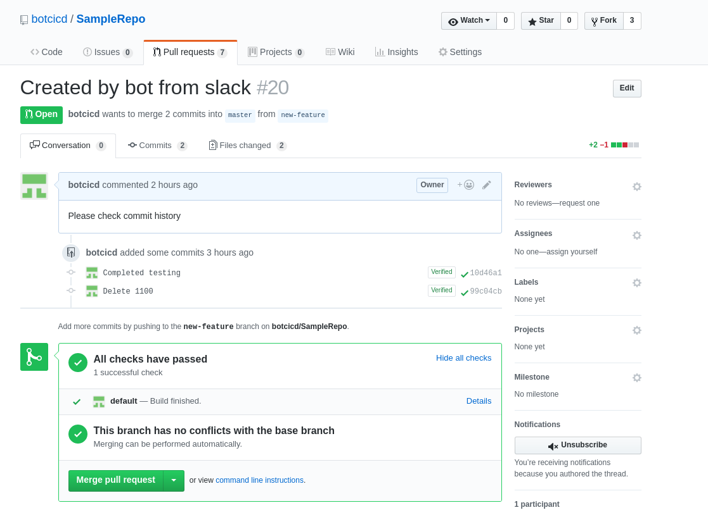
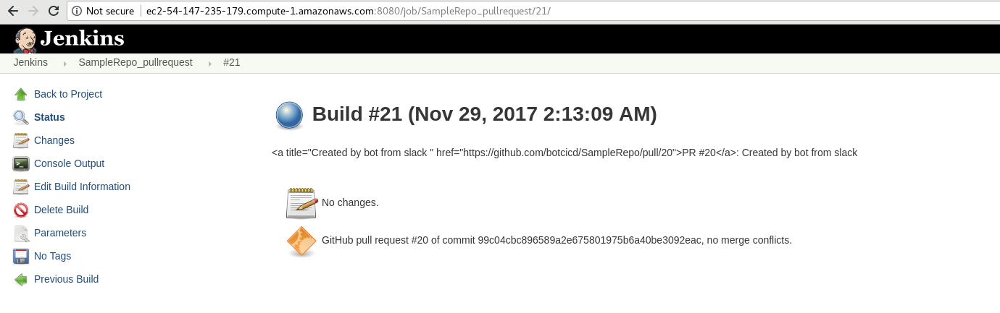
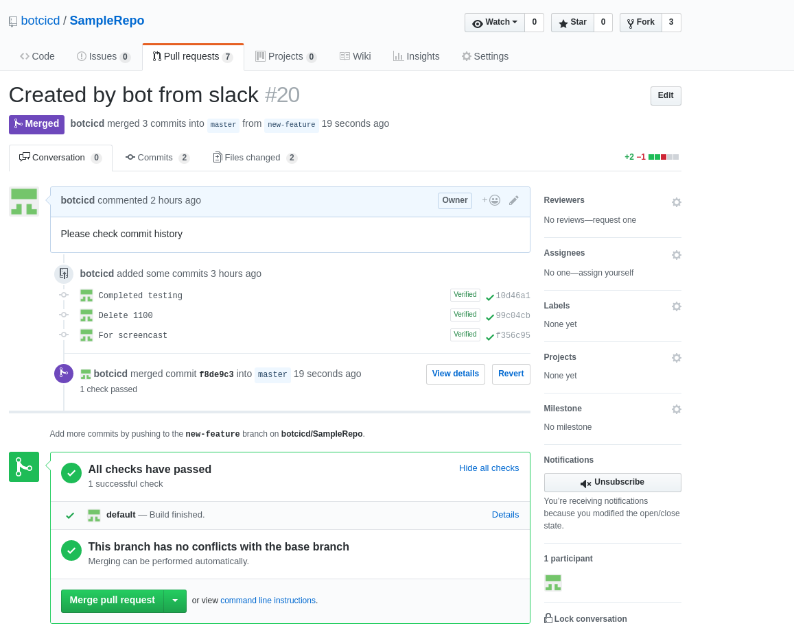

# Report

## The problem our bot solved

Cibot is a Slackbot that facilitates pull request management on Github. It is a one-stop bot for all actions that could be performed on pull requests that makes it very convenient for a user to perform actions like issuing a pull request, getting a list of all open pull requests, getting the details of a particular pull request and merging a pull request. An authorized user can perform all these actions by just typing simple commands on the Slack channel.

Cibot helps solve the problem of coordination within the team as all the notifications are received on Slack and thus the entire team is aware of the changes going on. Also, it helps the developers avoid the manual process of going to multiple parties to get the job done.

All the commands for the bot designed in such a way that the users can just tell the bot what to do in simple English sentences and the bot will automatically parse the sentence and trigger the required commands in the back end. This way, the users do not have to remember difficult and specific commands to get the job done.

## Primary features and screenshots

### The primary features of our bot are:

* Issue a new Pull Request for a given Repository from a base branch onto a HEAD branch
* View a list of all the pull requests on a given Repository.
* View the details of a Specific Pull Request.
* Merge a given Pull Request

### Screenshots:

#### Use Case 0: Getting list of commands that can be used with CiBot

#### Use Case 1: Issue a pull request

All it takes is a simple command like below to issue a pull request:

And as we can see it creates a new pull-request. But doesn't mention anything about checks. 

Because we have a cron job associated with Repo that builds whenever a new PR is issued like following.

Now we can see that it says all checks have been passed. 

#### Use Case 2: List open pull requests

We can get all the open pull requests by using hte following command.

We can then get more details about the particular pull request by selecting it. 

#### Use Case 3: Merge pull request

We can ask the bot to merge a pull request by issuing command as follows.

Before merging it checks if the user requesting merge is in the list of admins and also if the jenkins build was succesful. 
It's checking if the checks have passed.

It checks if the build has suceeded. 

It finally merges the PR request.

## Reflection on the development process and the project

We followed an agile development process throughout the project. The process was highly focussed on feature-driven development and we worked towards meeting our goals for each of milestones with the tasks being self-assigned. 

We used scrum methodology for project management. Short stand-up meetings helped us to have a track of our project development and progress of our tasks which was usually done at least thrice between the milestones. All the team members had different working schedules but these small scrum meetings helped us get visibility of each other's progress and blockers. This basically helped us prioritise our work and effective time management for the tasks involved by considering inputs from all the team members.

* Although the each member was assigned unique tasks the actual development was done together in an extreme programming manner.

* We extensively used GitHub Issues. For a detected bug or new enhancement, GitHub Issue was created. Each issue was assigned to a team member. There is tag associated with each issue to identify if it is Enhancement or Bug. 

* Since our project was on pull request management, we used pull requests to integrate work where the team-mates also had the chance to critique the work. This enabled us to beter our work and ensure that we got the best and did the best.

* Overall it was a very intense but valuable learning expereince. We learnt and practised Agile process that is being extensively used in most of the software based company. Moreover, working in a team helped us in identifying and understanding team dynamics and prepared us well for the real-life endeavors.

## Limitations and future work

### Limitations

* `CiBot` cannot create a pull request, which has merge-conflicts with the base branch.
* `CiBot` cannot merge the pull requests which are not auto-mergeable.

### Future work

* In case of a non-mergeable pull request, we can identify the specific commits which cause the pull request to be non-mergeable and then display a list of those commits to the users.
* By this we can provide recommendations, to create a successful pull request or to give specific steps to solve the merge conflict.
* Currently, the admin list is maintained by admin of the organization. Our ideology is to extend the functionality of maintaining the admin list through `CiBot`, where other members in the admin list can approve the new incoming member. Once approved, he/she will be added to the current admin list.
