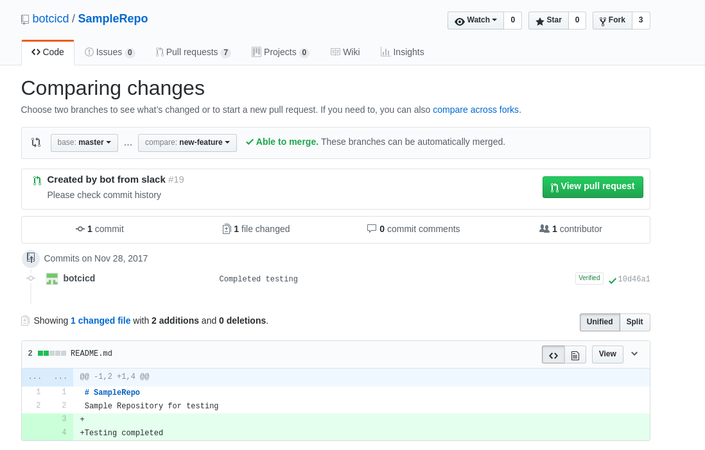
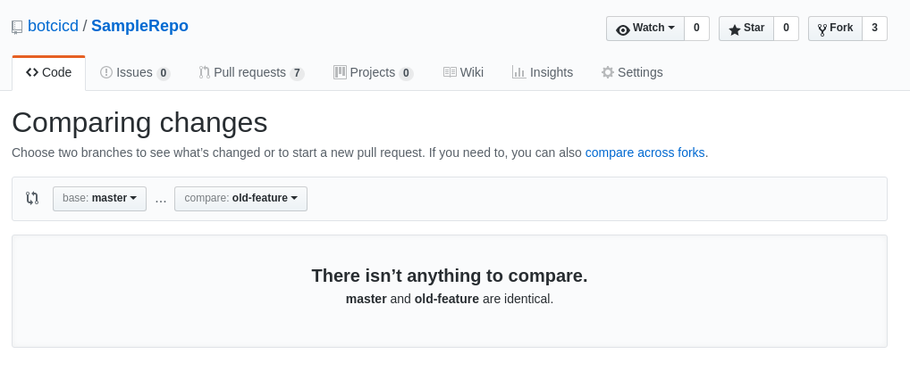
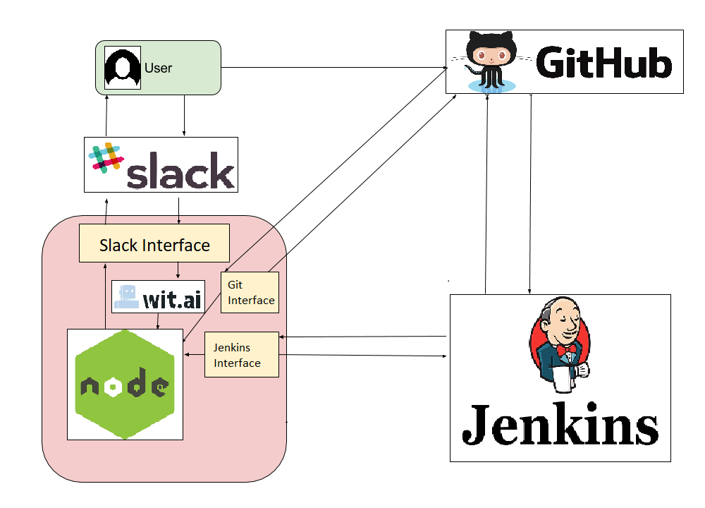

# Report

## The problem our bot solved
Cibot is a Slackbot that facilitates pull request management on Github. It is a one-stop bot for all actions that could be performed on pull requests that makes it very convenient for a user to perform actions like issuing a pull request, getting a list of all open pull requests, getting the details of a particular pull request and merging a pull request. An authorized user can perform all these actions by just typing simple commands on the Slack channel.

Cibot helps solve the problem of coordination within the team as all the notifications are received on Slack and thus the entire team is aware of the changes going on. Also, it helps the developers avoid the manual process of going to multiple parties to get the job done.

All the commands for the bot designed in such a way that the users can just tell the bot what to do in simple English sentences and the bot will automatically parse the sentence and trigger the required commands in the back end. This way, the users do not have to remember difficult and specific commands to get the job done.

Cibot helps the developers access various tools from within a conversation with the bot and allows the users to manage deployments and receive notifications.

## Primary features and screenshots

### The primary features of our bot are:

* Issue a new Pull Request for a given Repository from a base branch onto a HEAD branch
* View a list of all the pull requests on a given Repository.
* View the details of a Specific Pull Request.
* Merge a given Pull Request

### Screenshots:

#### Use Case 0: Getting list of commands that can be used with CiBot

#### Use Case 1: Issue a pull request

#### Use Case 2: List open pull requests

#### Use Case 3: Merge pull request

## Reflection on the development process and the project

Throughout the project development lifecycle, we followed agile methedology to build the Project in iterative milestones.

This is a high level architecture diagram of our project:

## Limitations and future work

### Limitations

* `CiBot` cannot create a pull request, which has merge-conflicts with the base branch.
* `CiBot` cannot merge the pull requests which are not auto-mergeable.

### Future work

* In case of a non-mergeable pull request, we can identify the specific commits which cause the pull request to be non-mergeable and then display a list of those commits to the users.
* By this we can provide recommendations, to create a successful pull request or to give specific steps to solve the merge conflict.
* Currently, the admin list is maintained by admin of the organization. Our ideology is to extend the functionality of maintaining the admin list through `CiBot`, where other members in the admin list can approve the new incoming member. Once approved, he/she will be added to the current admin list.